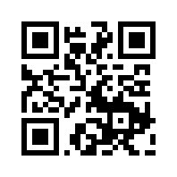

## Test Device Details

### ESP Launchpad Link
https://espressif.github.io/esp-launchpad/?flashConfigURL=https://shubhamdp.github.io/esp_ota/test_devices/launchpad_config.toml

---

### ESP32C3_Device_1

#### Matter Data of Device
```
{
  "vendorId": 65521,
  "productId": 32768,
  "uniqueDeviceId": "",
  "rotatingIdAlgorithm": "MATTER_V0",
  "discriminator": 1053,
  "passcode": 86789054,
}
```

#### Onboarding codes
- QRCode: MT:Y.K906PF1578ZS4QV10
- Manual Pairing Code: 10300652970

- QRCode image


---
